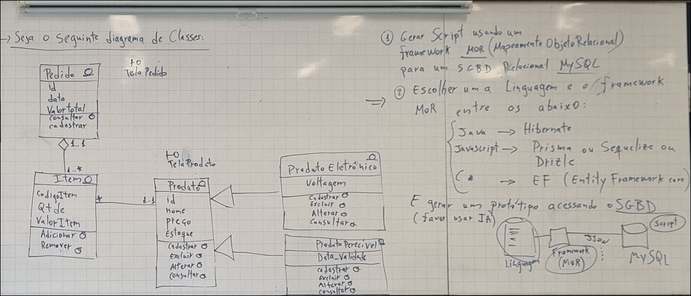

# Order Management System

Sistema de gestão de pedidos desenvolvido em Java com Spring Boot, Hibernate e MySQL.

### Enunciado 


*Imagem com o diagrama de classes e requisitos completos do projeto*


**Trabalho de Engenharia de Software II - PUC-Minas**

## 🚀 Quick Start

### Pré-requisitos
- Java 17+
- Maven 3.6+
- MySQL 5.7+

### Configuração

1. **Criar banco de dados** (opcional - Hibernate cria automaticamente)
```sql
CREATE DATABASE IF NOT EXISTS order_management_system;
```

2. **Configurar credenciais** em `application.properties`:
```properties
spring.datasource.url=jdbc:mysql://localhost:3306/order_management_system
spring.datasource.username=root
spring.datasource.password=sua_senha
```

3. **Executar**:
```bash
mvn clean install
mvn spring-boot:run
```

A aplicação estará em: **http://localhost:8080**

## 📋 Funcionalidades

- ✅ Gestão de Pedidos (criar, listar, deletar)
- ✅ Gestão de Produtos (criar, listar, deletar)
- ✅ Gestão de Itens de Pedidos
- ✅ Herança de Produtos (Eletrônico, Perecível)
- ✅ Interface web responsiva

## 📁 Estrutura

```
src/main/java/com/ordermanagement/
├── model/              # Entidades JPA
├── repository/         # Repositórios
├── service/            # Serviços (Lógica)
└── controller/         # REST Controllers

src/main/resources/
├── templates/          # HTML (View)
├── static/
│   ├── style.css       # Estilos
│   └── app.js          # JavaScript
└── application.properties
```

## 🔌 APIs Disponíveis

### Pedidos
- `GET /api/pedidos` - Listar
- `POST /api/pedidos` - Criar
- `DELETE /api/pedidos/{id}` - Deletar

### Produtos
- `GET /api/produtos` - Listar
- `POST /api/produtos` - Criar
- `DELETE /api/produtos/{id}` - Deletar

### Itens
- `GET /api/itens` - Listar
- `POST /api/itens` - Criar

## 📝 Tecnologias

- **Backend**: Spring Boot 3.2.5, Hibernate, MySQL
- **Frontend**: HTML5, CSS3, JavaScript (Fetch API)
- **Database**: MySQL 5.7+
- **Build**: Maven

## Autores

- **Felipe Barros**
- **Vitor Gomes**